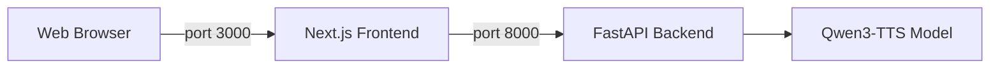

<p align="center">
  <h1 align="center">🦜 Parrot AI - Voice Cloning</h1>
  <p align="center"><strong>If you can hear it, we can clone it.</strong></p>
  <p align="center">
    <a href="#features">Features</a> •
    <a href="#architecture">Architecture</a> •
    <a href="#installation">Installation</a> •
    <a href="#usage">Usage</a>
  </p>
</p>

---

A powerful voice cloning application powered by **Qwen3-TTS-12Hz-1.7B-Base**. Upload a short voice sample (5-10 seconds) and generate natural-sounding speech in that voice.

## ✨ Features

- **🎯 High-Quality Voice Cloning** - Clone any voice from just 5-10 seconds of audio
- **⚡ GPU Accelerated** - Runs on CUDA for fast inference
- **🎙️ Dual Input Modes** - Record via microphone or upload audio files
- **📝 Optional Transcript** - Provide transcript for even better voice matching
- **🌐 Web Interface** - Modern Next.js React UI accessible from any browser
- **🚀 Easy Setup** - Simple installation with pip and npm

## 🏗️ Architecture

This project uses a split architecture:

- **Backend (Port 8000)**: Python/FastAPI server hosting the Qwen3-TTS model.
- **Frontend (Port 3000)**: Next.js React application for the user interface.

> **Note:** The frontend code is maintained in a separate repository: [parrot-ai-frontend-qwen](https://github.com/GODOSTROYER/parrot-ai-frontend-qwen)



## 📋 Prerequisites

Before installing, ensure you have:

| Requirement  | Version   | Notes                          |
| ------------ | --------- | ------------------------------ |
| **Python**   | 3.10+     | Tested with 3.12               |
| **Node.js**  | 18+       | Required for frontend          |
| **CUDA GPU** | 8GB+ VRAM | RTX 3060 or better recommended |
| **PyTorch**  | 2.0+      | With CUDA support              |
| **SoX**      | 14.4.2+   | Audio processing library       |

### Installing SoX (Windows)

1. Download from: https://sourceforge.net/projects/sox/files/sox/
2. Install to `C:\Program Files\sox-14.4.2`
3. Add to PATH or use the provided `run.bat` (backend only)

## 🚀 Installation

### 1. Clone the Repository

```bash
git clone https://github.com/GODOSTROYER/Voice-Cloner-Qwen-Arnav.git
cd Voice-Cloner-Qwen-Arnav
```

### 2. Backend Installation

Set up the Python environment for the API server.

```bash
# Create virtual environment
python -m venv .venv

# Activate (Windows)
.venv\Scripts\activate

# Install PyTorch with CUDA (Adjust for your version)
pip install torch torchvision torchaudio --index-url https://download.pytorch.org/whl/cu121

# Install dependencies
pip install -r requirements.txt
```

### 3. Frontend Installation

Set up the Next.js web interface.

```bash
cd frontend
npm install
# Return to root
cd ..
```

## 💻 Usage

You need to run **two separate terminals** to start the full application.

### Terminal 1: Start Backend

This starts the API server on port 8000.

**Option A: Using Batch Script (Windows)**

```bash
run.bat
```

**Option B: Manual Start**

```bash
.venv\Scripts\activate
# Ensure SoX is in PATH
python -m uvicorn backend:app --host 0.0.0.0 --port 8000 --reload
```

Wait until you see `Application startup complete`.

### Terminal 2: Start Frontend

This starts the web UI on port 3000.

```bash
cd frontend
npm run dev
```

### Access the Web UI

Open your browser and navigate to:

```
http://localhost:3000
```

## 📝 Tips for Best Results

- Use **5-10 seconds** of clear, single-speaker audio
- Avoid background noise or music in reference audio
- Providing a **transcript** of the reference audio improves quality
- Works best with natural, conversational speech

## ⚙️ Configuration

Key parameters in `app.py`:

| Parameter    | Default                         | Description                    |
| ------------ | ------------------------------- | ------------------------------ |
| `MODEL_NAME` | `Qwen/Qwen3-TTS-12Hz-1.7B-Base` | HuggingFace model path         |
| `DEVICE`     | `cuda:0`                        | GPU device (falls back to CPU) |

## 📐 Troubleshooting

- **QuotaExceededError**: Clear the browser's Local Storage if you generate too much history.
- **Port Conflicts**: Ensure ports 8000 and 3000 are free.
- **CORS Errors**: Ensure the backend is running and `localhost:3000` is in the allowed origins list in `backend.py`.

## 🙏 Credits

- **Model**: [Qwen3-TTS](https://huggingface.co/Qwen/Qwen3-TTS-12Hz-1.7B-Base) by Alibaba
- **Backend Framework**: [FastAPI](https://fastapi.tiangolo.com/)
- **Frontend Framework**: [Next.js](https://nextjs.org/)

## 📜 License

This project is for educational and research purposes. Please respect the licenses of the underlying models and libraries.

---

<p align="center">
  Made with ❤️ by <a href="https://github.com/GODOSTROYER">GODOSTROYER</a>
</p>
