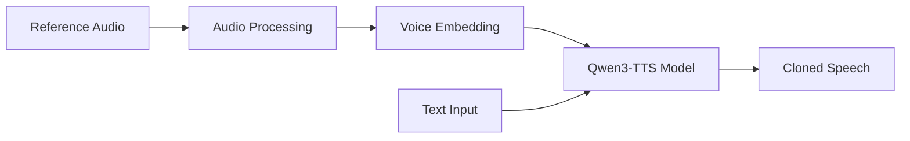

<p align="center">
  <h1 align="center">🦜 Parrot AI - Voice Cloning</h1>
  <p align="center"><strong>If you can hear it, we can clone it.</strong></p>
  <p align="center">
    <a href="#features">Features</a> •
    <a href="#demo">Demo</a> •
    <a href="#installation">Installation</a> •
    <a href="#usage">Usage</a> •
    <a href="#architecture">Architecture</a>
  </p>
</p>

---

A powerful voice cloning application powered by **Qwen3-TTS-12Hz-1.7B-Base**. Upload a short voice sample (5-10 seconds) and generate natural-sounding speech in that voice.

## ✨ Features

- **🎯 High-Quality Voice Cloning** - Clone any voice from just 5-10 seconds of audio
- **⚡ GPU Accelerated** - Runs on CUDA for fast inference
- **🎙️ Dual Input Modes** - Record via microphone or upload audio files
- **📝 Optional Transcript** - Provide transcript for even better voice matching
- **🌐 Web Interface** - Beautiful Gradio-based UI accessible from any browser
- **🚀 Easy Setup** - Simple installation with pip

## 🎬 Demo

The application provides a web interface where you can:

1. Upload or record a reference voice sample
2. Optionally provide a transcript of the reference audio
3. Enter the text you want the cloned voice to speak
4. Generate and download the cloned audio

## 📋 Prerequisites

Before installing, ensure you have:

| Requirement  | Version   | Notes                          |
| ------------ | --------- | ------------------------------ |
| **Python**   | 3.10+     | Tested with 3.12               |
| **CUDA GPU** | 8GB+ VRAM | RTX 3060 or better recommended |
| **PyTorch**  | 2.0+      | With CUDA support              |
| **SoX**      | 14.4.2+   | Audio processing library       |

### Installing SoX (Windows)

1. Download from: https://sourceforge.net/projects/sox/files/sox/
2. Install to `C:\Program Files\sox-14.4.2`
3. Add to PATH or use the provided `run.bat`

## 🚀 Installation

### 1. Clone the Repository

```bash
git clone https://github.com/GODOSTROYER/Voice-Cloner-Qwen-Arnav.git
cd Voice-Cloner-Qwen-Arnav
```

### 2. Create Virtual Environment

```bash
python -m venv .venv

# Windows
.venv\Scripts\activate

# Linux/Mac
source .venv/bin/activate
```

### 3. Install PyTorch with CUDA

```bash
# For CUDA 12.1 (adjust for your CUDA version)
pip install torch torchvision torchaudio --index-url https://download.pytorch.org/whl/cu121
```

### 4. Install Dependencies

```bash
pip install -r requirements.txt
```

### 5. (Optional) Install Flash Attention 2

For faster inference on supported GPUs:

```bash
pip install flash-attn --no-build-isolation
```

> **Note:** Flash Attention requires CUDA Toolkit and Visual Studio Build Tools on Windows. The app works without it (uses PyTorch's native attention).

## 💻 Usage

### Quick Start (Windows)

```bash
run.bat
```

### Manual Start

```bash
# Ensure SoX is in PATH
set PATH=%PATH%;C:\Program Files\sox-14.4.2

# Run the app
python app.py
```

### Access the Web UI

Open your browser and navigate to:

```
http://localhost:7860
```

## 🏗️ Architecture

```
Voice-Cloner-Qwen-Arnav/
├── app.py              # Main Gradio application
├── requirements.txt    # Python dependencies
├── run.bat            # Windows launcher script
└── website/           # Static web assets
    ├── index.html     # Landing page
    ├── index.css      # Styles
    └── index.js       # JavaScript
```

### How It Works



1. **Audio Processing** - Reference audio is loaded and preprocessed using librosa
2. **Voice Embedding** - The model extracts voice characteristics (x-vector or full prompt)
3. **Text-to-Speech** - Qwen3-TTS generates speech with the cloned voice characteristics

## 📝 Tips for Best Results

- Use **5-10 seconds** of clear, single-speaker audio
- Avoid background noise or music in reference audio
- Providing a **transcript** of the reference audio improves quality
- Works best with natural, conversational speech

## ⚙️ Configuration

Key parameters in `app.py`:

| Parameter     | Default                         | Description                    |
| ------------- | ------------------------------- | ------------------------------ |
| `MODEL_NAME`  | `Qwen/Qwen3-TTS-12Hz-1.7B-Base` | HuggingFace model path         |
| `DEVICE`      | `cuda:0`                        | GPU device (falls back to CPU) |
| `server_port` | `7860`                          | Web server port                |

## 🙏 Credits

- **Model**: [Qwen3-TTS](https://huggingface.co/Qwen/Qwen3-TTS-12Hz-1.7B-Base) by Alibaba
- **UI Framework**: [Gradio](https://gradio.app/)

## 📜 License

This project is for educational and research purposes. Please respect the licenses of the underlying models and libraries.

---

<p align="center">
  Made with ❤️ by <a href="https://github.com/GODOSTROYER">GODOSTROYER</a>
</p>
