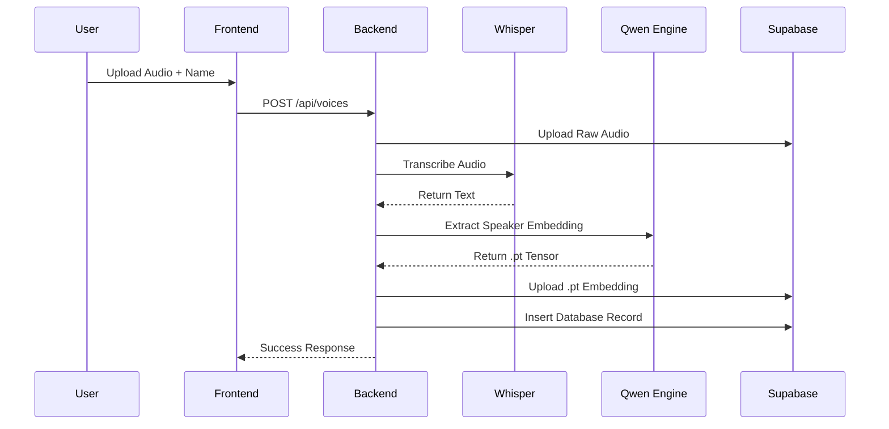

# 🌐 API & System Integration

The Parrot AI backend serves as the bridge between the AI models and the frontend, managing data persistence and security.

## 📡 API Endpoints

The system uses a REST API built with FastAPI.

| Endpoint | Method | Description |
| :--- | :--- | :--- |
| `/api/transcribe` | `POST` | Converts uploaded audio to text using Whisper. |
| `/api/voices` | `GET` | Lists all saved voice profiles for the current user. |
| `/api/voices` | `POST` | Saves a new voice profile (audio + embedding). |
| `/api/generate` | `POST` | Simple TTS generation returning a WAV file. |
| `/api/generate-stream` | `POST` | Real-time streaming TTS using SSE (Server-Sent Events). |
| `/api/model/switch` | `POST` | Dynamically switches the active Qwen model variant. |

## ☁️ Supabase Integration

Parrot AI uses Supabase as its primary cloud infrastructure for the "SaaS Edition".

### 1. Database (Postgres)
Stores metadata for voices, including:
- `voice_id`: Unique identifier.
- `user_id`: Link to the authenticated user.
- `name`: Display name of the voice.
- `audio_path`: Reference to the WAV file in storage.
- `embedding_path`: Reference to the `.pt` embedding in storage.

### 2. Storage (Buckets)
- `voice-audio`: Stores the original reference audio samples.
- `voice-embeddings`: Stores the pre-calculated PyTorch tensor files (`.pt`) for instant cloning.

## 🔄 Sequence: Saving a New Voice

## 🔒 Authentication
Authentication is handled via Supabase Auth. The backend verifies the JWT token in the `Authorization` header for every protected endpoint using the `get_current_user` dependency.

---
> [!IMPORTANT]
> To reduce latency, voice embeddings are cached locally after the first download from Supabase Storage.
