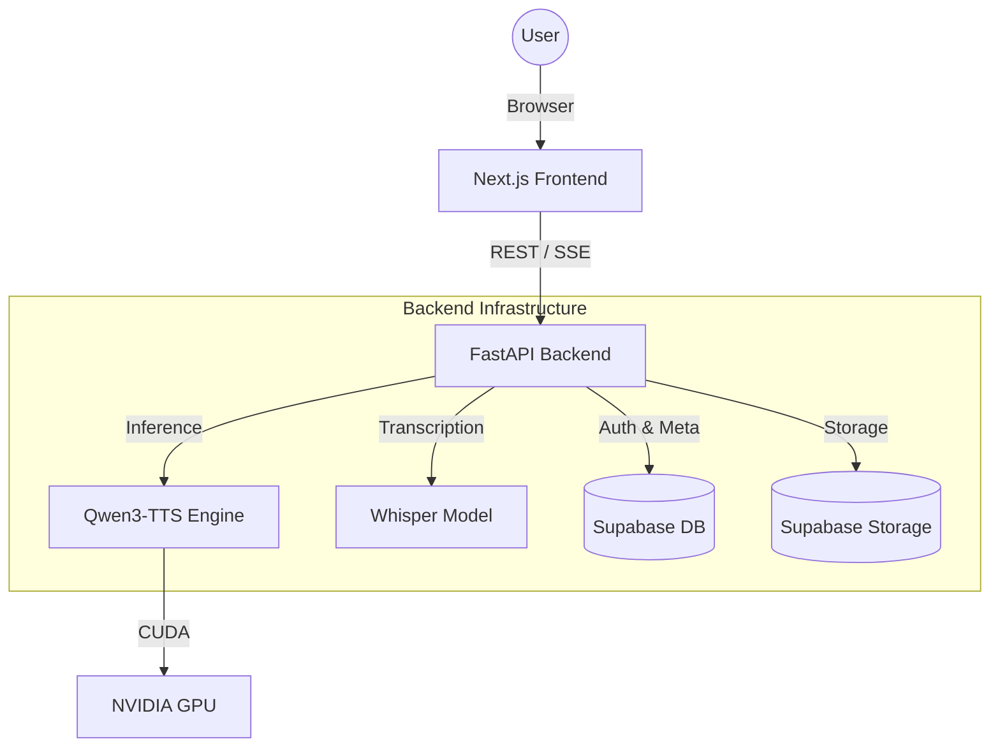

# 🏗️ Parrot AI - Architecture Overview

Parrot AI is a state-of-the-art voice cloning system designed for high-fidelity audio synthesis. It follows a decoupled architecture, separating the heavy machine learning inference from the user interface.

## 📐 System Context

The application is split into two primary layers: a **Next.js Frontend** and a **FastAPI Backend**.

## 🧩 Core Components

### 1. Web Interface (Frontend)
- **Framework**: Next.js (React)
- **Purpose**: Provides a modern UI for voice recording, file uploading, and text-to-speech generation.
- **Interactions**: Uses Server-Sent Events (SSE) for real-time progress updates during long audio generations.

### 2. API Server (Backend)
- **Framework**: FastAPI (Python)
- **Purpose**: Orchestrates the voice cloning pipeline, handles user authentication, and manages data persistence.
- **Key Logic**: The `ModelManager` singleton handles the loading and switching of different Qwen variants (Base, Design, Custom).

### 3. Inference Engine (Qwen3-TTS)
- **Model**: `Qwen3-TTS-12Hz-1.7B-Base`
- **Purpose**: The "brain" of the system. It takes a text prompt and a reference voice prompt (embedding) to synthesize audio.
- **Optimization**: Implements text chunking for long prompts and GPU acceleration via CUDA.

### 4. Transcription Engine (Whisper)
- **Model**: OpenAI Whisper (Base)
- **Purpose**: Automatically transcribes uploaded reference audio to provide high-quality reference text for the In-Context Learning (ICL) mode of Qwen.

## 🔄 Data Persistence Flow

1. **Voice Profiles**: Reference audio files are stored in Supabase Storage.
2. **Embeddings**: Speaker embeddings (x-vectors) are pre-calculated and stored as `.pt` files in Supabase to allow instant cloning without re-processing.
3. **Metadata**: User information and voice associations are stored in Supabase Postgres.

---
> [!NOTE]
> This architecture is designed for scalability, allowing the backend to be hosted on GPU-enabled instances while the frontend remains lightweight and fast.
