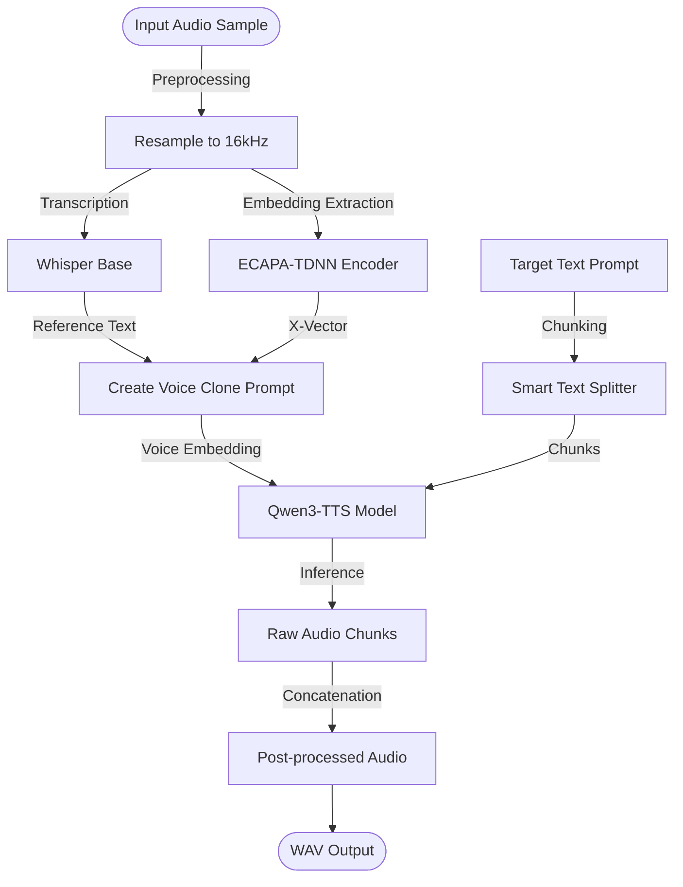

# 🎙️ Engine & Inference Deep Dive

The core of Parrot AI is the **Qwen3-TTS** engine. This document explains how the system processes voice samples and generates cloned speech.

## 🧠 Qwen3-TTS Model
The system uses the `Qwen3-TTS-12Hz-1.7B-Base` model. Unlike traditional TTS models, Qwen3-TTS is a large language model fine-tuned for speech synthesis, allowing it to "understand" and "mimic" voices via in-context learning.

## 🔄 Voice Cloning Pipeline

The cloning process follows these steps:

## 🛠️ Key Technical Features

### 1. Zero-Shot Voice Cloning
Using as little as 5-10 seconds of audio, the system extracts a speaker embedding (x-vector). This embedding represents the unique characteristics of the speaker's voice (pitch, tone, resonance).

### 2. Dual-Mode Inference
- **ICL Mode (In-Context Learning)**: Uses both the speaker embedding and the transcript of the reference audio. This provides the highest accuracy.
- **X-Vector Only Mode**: Uses only the speaker embedding. Useful when a transcript is unavailable or the audio is very short.

### 3. Smart Text Chunking
To handle long sentences without quality degradation, the backend implements `smart_split_text`. It splits text at natural boundaries (periods, commas) to ensure each chunk is within the model's optimal context window (~500 characters).

### 4. Audio Normalization
Generated audio often has varying peak levels. The system automatically normalizes the output to -1dB and clamps values to prevent clipping, ensuring a professional, consistent sound.

## ⚡ Performance Optimization
- **CUDA Acceleration**: All heavy tensor operations are performed on the GPU.
- **BFloat16 Precision**: Uses half-precision floating point to reduce VRAM usage and increase throughput.
- **Lazy Loading**: Models are loaded into VRAM only when needed via the `ModelManager`.

---
> [!TIP]
> Clear, dry (no reverb) audio samples yield the best cloning results. Background noise can interfere with the speaker embedding extraction.
